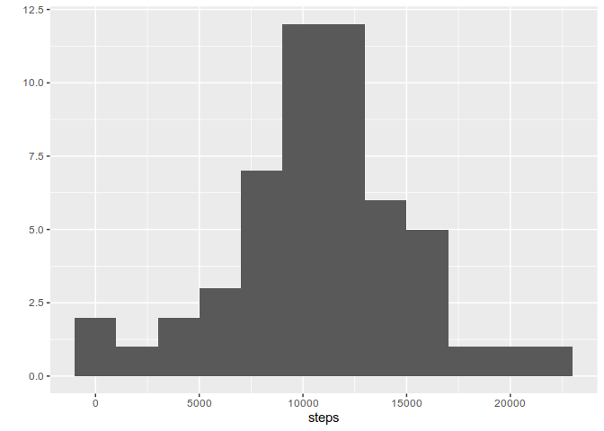
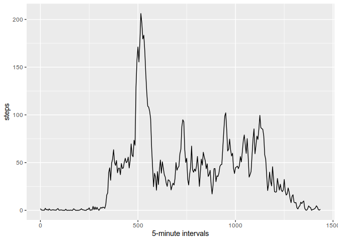
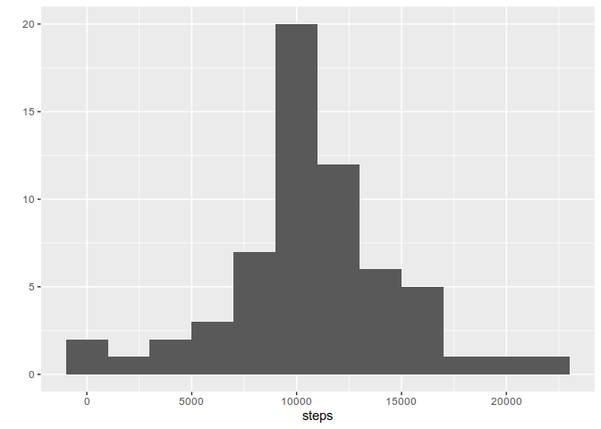
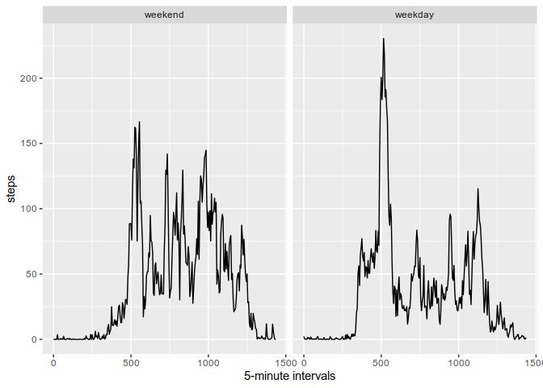

This project will consist of an analysis from data collected of a personal activity monitoring device.
The dataset could be found at this [github repository](https://github.com/rdpeng/RepData_PeerAssessment1), accessed at 2020/08/27. The repository doesn't makes any mention to the origin of the dataset.

The data consists of two months of data from an anonymous individual collected from a personal activity monitoring device during the months of October and November, 2012 and include the number of steps taken in 5 minute intervals each day.

Before starting the analysis, all libraries utilized will be loaded for cleaner code on each segment:


```r
Sys.setlocale("LC_TIME", "C")
library(ggplot2)
library(tidyr) 
library(dplyr)
```

```
## 
## Attaching package: 'dplyr'
```

```
## The following objects are masked from 'package:stats':
## 
##     filter, lag
```

```
## The following objects are masked from 'package:base':
## 
##     intersect, setdiff, setequal, union
```

```r
library(chron)
```

```
## NOTE: The default cutoff when expanding a 2-digit year
## to a 4-digit year will change from 30 to 69 by Aug 2020
## (as for Date and POSIXct in base R.)
```

## Loading and preprocessing the data

The data was originally compressed on a zip format, but the code will assume an already decompressed csv file.


```r
data = read.csv('activity.csv')
```

Looking at the data, it is possible to see that there are three variables provided: the steps on each 5-minute interval, the date of the collection and the respective interval.

Looking at the interval values, as evidenced by the selected rows below, it is possible to see that they are on a format hour-minute truncated.


```r
data[240:245, ]
```

```
##     steps       date interval
## 240    NA 2012-10-01     1955
## 241    NA 2012-10-01     2000
## 242    NA 2012-10-01     2005
## 243    NA 2012-10-01     2010
## 244    NA 2012-10-01     2015
## 245    NA 2012-10-01     2020
```

So, to prepare the data for the following analysis, the column types and the intervals problem will be treated.

After separating the interval into hour and minute variables, a new interval with sequenced values is calculated. This is necessary to remove distortions when plotting the activities time series caused by the gap between the 55 minutes from one hour to the 00 minutes value from the following one. 


```r
data$date = as.Date(data$date)
data = data %>% separate(interval, into = c('hour', 'min'), sep = -2, convert = T) %>% replace_na(list(hour = 0))
data$time = strptime(paste(data$date, data$hour, data$min), format = '%F %H %M')
data$interval = with(data, 60 * hour + min)
```


## What is mean total number of steps taken per day?

For this section the number of steps on each day will be analyzed. First the simple sum of the values need to be calculated.


```r
total_steps = aggregate(steps ~ date, data, sum)
```

We can see on the following histogram that the majority of the days consisted of results around 10,000 steps, confirmed by the mean and median calculated, and resembles a normal distribution with minimum of 0 steps and maximum around 23,000 steps.


```r
qplot(steps, data = total_steps, binwidth = 2000)
```

<!-- -->


```r
with(total_steps, cbind(
  mean_steps = mean(steps, na.rm = T),
  median_steps = median(steps, na.rm = T)
))
```

```
##      mean_steps median_steps
## [1,]   10766.19        10765
```

## What is the average daily activity pattern?

For this section, the steps on each interval averaged on the days will be considered.

Looking at the time series plot, we can see the low values on the beginning and end of the intervals. This result is consistent with the expected as it comprises of the late night and early morning periods, where people are less active.


```r
steps_by_interval = aggregate(steps ~ interval, data, mean, na.action = na.omit)
qplot(interval, steps, data = steps_by_interval, geom = 'line', xlab = '5-minute intervals')
```

<!-- -->

It is also possible to see that the maximum number of steps happens at around 08:35, which has considerably higher values than the rest of the intervals.


```r
pos = which.max(steps_by_interval$steps)
interval = steps_by_interval[pos, 'interval']
time = data[which(data$interval == interval), c('interval', 'hour', 'min')][1, ]
time
```

```
##     interval hour min
## 104      515    8  35
```

## Imputing missing values

On this section, the missing data will be filled with coherent values.
First, we can confirm that all missing values are on the steps column, hence there is no data provided with uncertain timestamp.


```r
colSums(is.na(data))
```

```
##    steps     date     hour      min     time interval 
##     2304        0        0        0        0        0
```

Then, the number of days that has both missing values and provided data will be calculated. As none of them attends this criteria, imputing using the daily mean proved to be an inefficient approach.


```r
count_steps = data %>% group_by(date) %>% summarize(na_count = sum(is.na(steps)), non_na_count = sum(!is.na(steps)))
```

```
## `summarise()` ungrouping output (override with `.groups` argument)
```

```r
with(count_steps, sum(na_count!=0 & non_na_count!=0))
```

```
## [1] 0
```

As such, the data will be filled using the average from each correspondent interval.


```r
impute_mean <- function(x) {mean_ = mean(x, na.rm = T); ifelse(is.na(x), mean_, x) }
data_filled = data %>% group_by(interval) %>% mutate(steps = impute_mean(steps)) %>% as.data.frame()
```

After doing so, we will look at the number of steps on each day again.

It is possible to confirm that the mean of the data doesn't have any change, and the change occurs as the introduction of "new" data of same value as the mean changes one of the bins on the histogram and slightly the median.


```r
total_steps_filled = aggregate(steps ~ date, data_filled, sum)
qplot(steps, data = total_steps_filled, binwidth = 2000)
```

<!-- -->


```r
with(total_steps_filled, cbind(
  mean_steps = mean(steps, na.rm = T),
  median_steps = median(steps, na.rm = T)
))
```

```
##      mean_steps median_steps
## [1,]   10766.19     10766.19
```

## Are there differences in activity patterns between weekdays and weekends?

For this section, the data will be separated on two groups comparing the date: the weekend and weekdays groups.


```r
data_filled$weekday = as.factor(!is.weekend(data_filled$date))
levels(data_filled$weekday) =  c('weekend', 'weekday')
```

Comparing the data of the two groups, we can see that the maximum of steps originally described is much more evident on the weekdays groups, the number of steps on the weekend days are more evenly distributed and that the low steps intervals are consistent between the groups.

The change on the patterns could be explained from work related matters, as commuting being the maximum observed and the subsequent smaller values associated with the work routine. However, the is insufficient data to support this analysis and other informations are necessary.


```r
steps_by_intervalday = aggregate(steps ~ interval+weekday, data_filled, mean, na.action = na.omit)
qplot(interval, steps, data = steps_by_intervalday, geom = 'line', xlab = '5-minute intervals', facets = .~weekday)
```

<!-- -->
